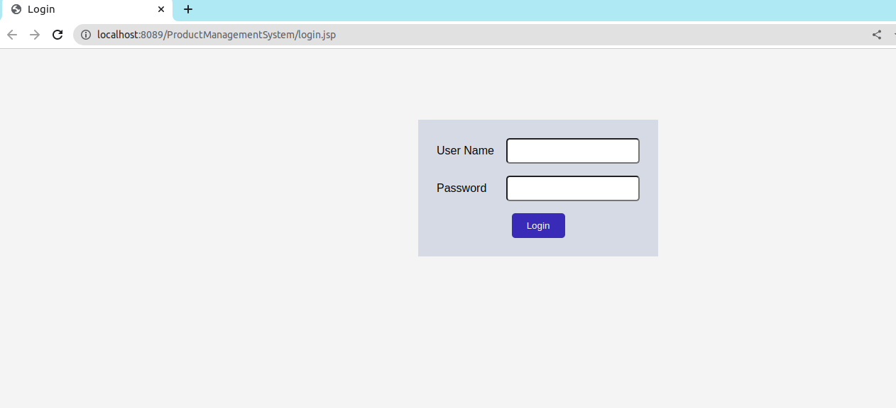
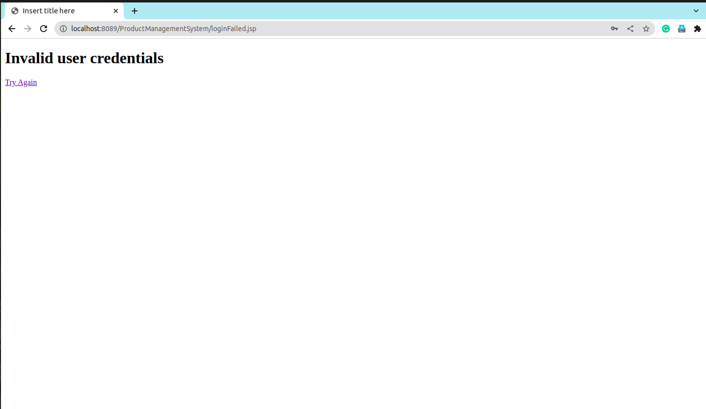
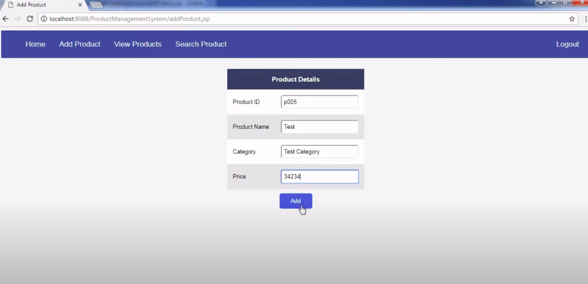
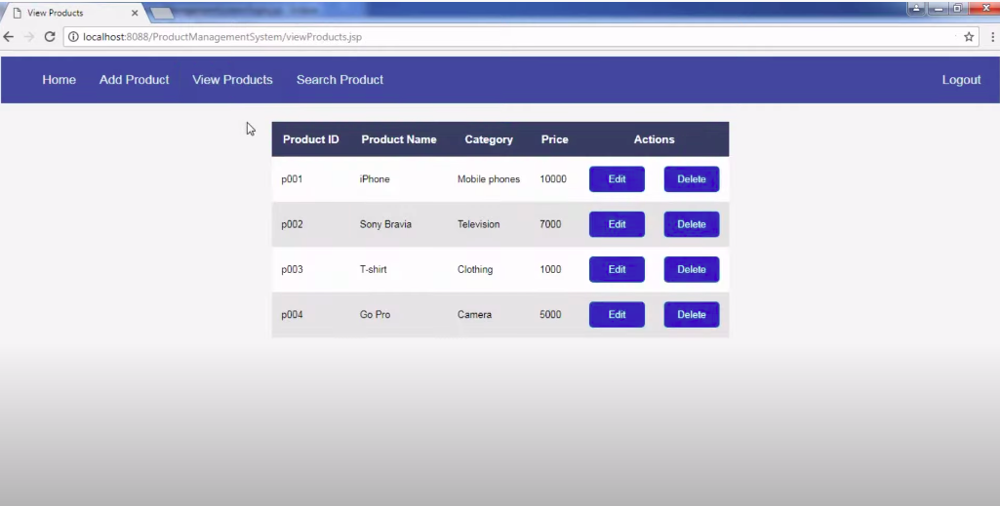
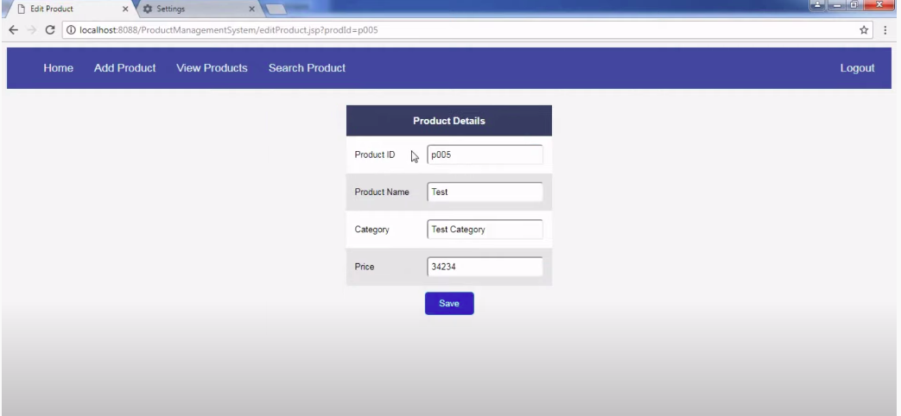
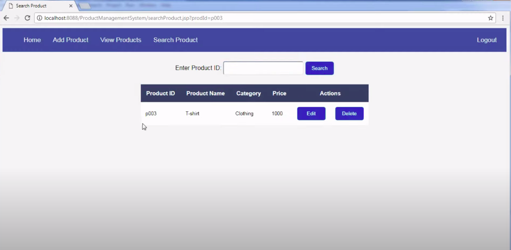

This is a product management software to manage the product with the multiple operations : 
1- User can Create his Personal login for security purposes. 
2- User can Add Products. 
3- User can edit Products. 
4- User can Delete Products. 
5.User can search products 

<h2>About</h2>
This Project contains following classes : 
1. LoginDAO  
2. ProductManagementDAO  
3. DBUtil   
4. loginInfo   
5. Product   
 

It has also following JSP Pages with a style.css file:  
1. Login.jsp  
2. Logout.jsp   
3. LoginFailed.jsp    
4. AddProduct.jsp   
5. EditProduct.jsp   
6. Error.jsp    
7. Header.jsp    
8. Home.jsp    
9. processAdd   
10. processDelete   
11. processLogin   
12. searchProduct   
13. viewProduct   
 
<h2>DataBase</h2>
-->MySQL with Java DataBase Connectivity 
<h4>Tables : </h4>
1. Login_info(User_name, Password) 
2. Prdouct(Product_id,Product_name,Product_category,Product_price) 
 
<h3>Login Page</h3>
 
<h3>Login Fail Page</h3>
 
<h3>Add Product Page</h3>

<h3>View Product Page</h3>

<h3>Edit Product Page</h3>

<h3>Search Product Page</h3>

